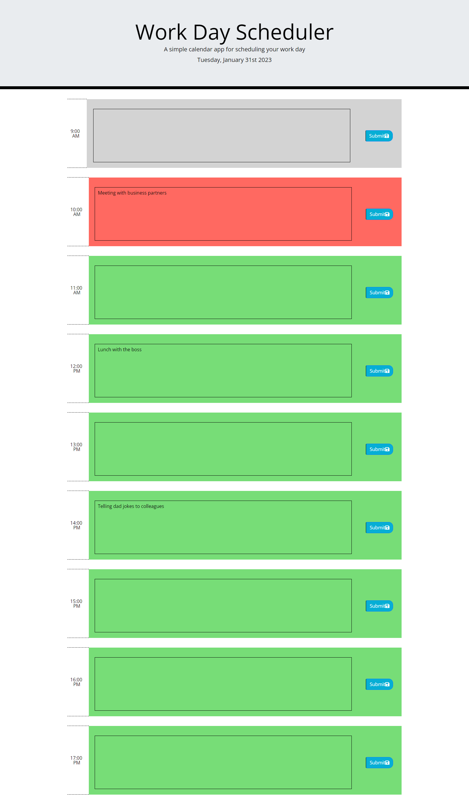

# Work_Day_Scheduler

## Description
This is a simple calendar app that allows the user to save events for each office hour of the day.

## Usage
It doesn't require any installation. As a user of the calendar app you will be able to see the current day with date at the top of the calendar. When you scroll down the website presents timeblocks for standard business hours and you will see each timeblock color-coded according to that if that is past, present or future. Once you click a timeblock you will be able to type an event and save it to the localStorage. Once it gets saved there you will able to see that even after refreshing the page. The project use HTML, CSS, Bootsrap 4, JQery and MomentJS.

Please see a mockup image of the website below:

Here is the link for the deployed webpage: https://vighimre87.github.io/Work_Day_Scheduler/

## Credits
N/A
 

## License
Plese refer to the LICENSE file in the repo.